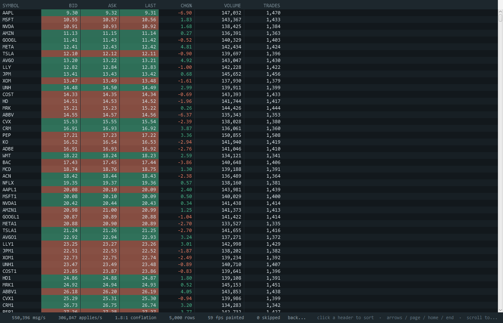
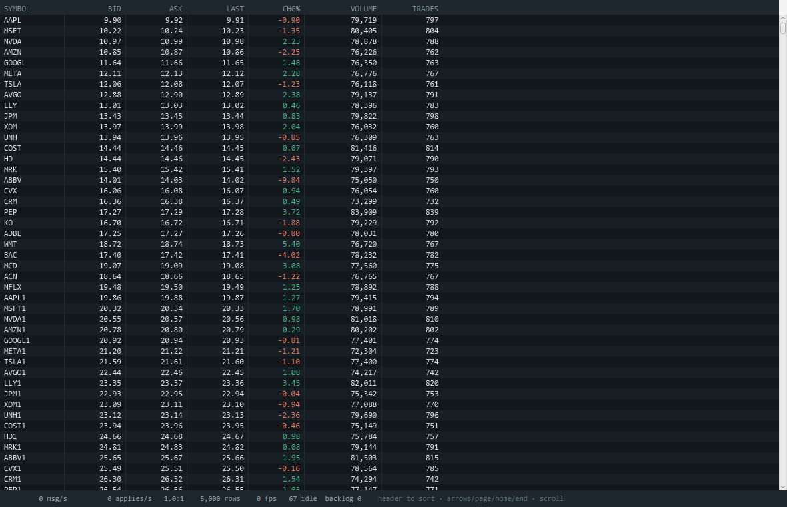
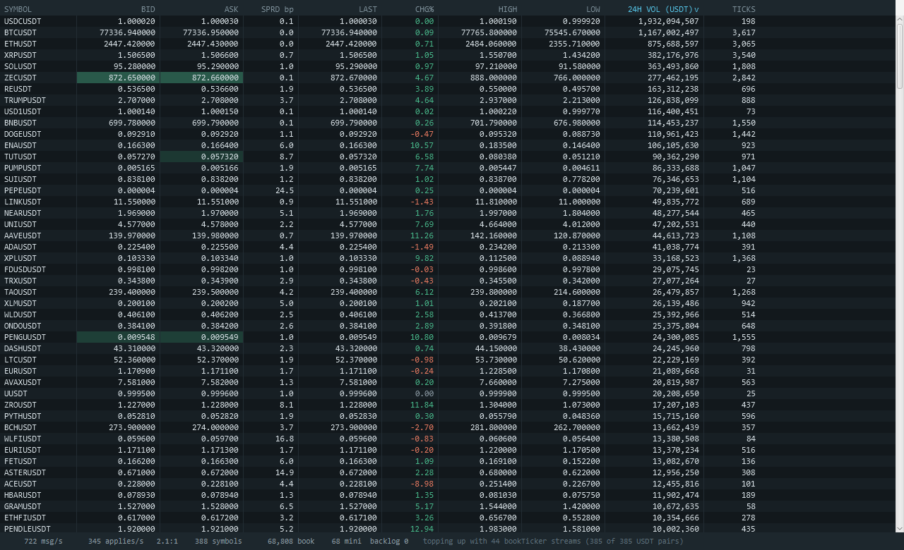

# TickGrid

A canvas-rendered, virtualized data grid for JavaFX, built for real-time market data.



**[API documentation](https://jawadoffline.github.io/tickgrid/)** · [benchmarks](BENCHMARKS.md)

Canvas text throughput proved first, then the columnar store, thread-agnostic conflated ingestion,
sort and filter with an atomically swapped snapshot, the renderer, a frame-time harness that
measures all of it against `TableView`, JMH microbenchmarks, a Gradle build that publishes it, and
a live Binance feed.

Section references throughout (§1, §3.2, §6 and so on) point at a separate design document that is
not part of this repository. They are kept because the commentary reads better when it says which
claim it is answering — nothing here depends on having read it.

```
./gradlew build                          compile + 141 tests
./gradlew :tickgrid-demo:run             the blotter, on synthetic data
./gradlew :tickgrid-demo:binance         the blotter, on live Binance market data
./gradlew :tickgrid-demo:handshakeDemo   proves the ingress tests have teeth
./gradlew :tickgrid-demo:sortContractDemo   sorts against a live store until TimSort throws
./gradlew :tickgrid-demo:throughputProbe    rate, allocation, conflation
./gradlew :tickgrid-demo:storeProbe         what a capacity actually costs
./gradlew :tickgrid-bench:bench          frame time / staleness / CPU vs TableView
./gradlew :tickgrid-bench:jmh            JMH microbenchmarks, with -prof gc
./gradlew :tickgrid-core:verifyJlink     links the module into a runtime image
```

Add `-Prows=200 -Prates=100000,1000000` to the bench. Run benchmarks from a quiet machine, never
from a warm Gradle daemon — the build competes for the cores you are trying to measure.

### Layout

| module | published | contains |
|---|---|---|
| `tickgrid-core` | **yes**, as `io.github.tickgrid:tickgrid` | the library: ingress, store, view, render |
| `tickgrid-demo` | no | the blotter and the console demonstrations |
| `tickgrid-bench` | no | the comparison harness, and HdrHistogram with it |
| `consumer-check` | no | a standalone project that resolves the published coordinate |

The library has **one non-JavaFX dependency**, JCTools. It ships a real `module-info`
(`module io.github.tickgrid`), and `./gradlew :tickgrid-core:verifyJlink` links it into a runtime
image on every CI run — so a consumer shipping a `jpackage`d application can strip it down. That
works because JCTools 4.x is a proper named module rather than an automatic one; had it not been,
the choice would have been to shade it or to give up on jlink.

JavaFX is published at **compile** scope, not runtime: `TickGridView extends Region` and
`GridTheme` exposes `Color`, so the types are in the public API and belong on a consumer's compile
classpath. It carries no platform classifier, so each consumer resolves the native jar for the
machine they build on.

## What's here

| | |
|---|---|
| `ingress/KeyIndex` | Lock-free key→slot map. Preallocated, open-addressed, **no rehash**. |
| `ingress/ConflatingIngress` | Staging arena, per-slot seqlocks, dirty flags, MPSC queue, budgeted drain. |
| `ingress/RowExtractor` | How a producer's row becomes columns. Runs inside the seqlock window. |
| `store/Schema` · `ColumnSpec` · `ColumnKind` | Typed column declarations, and the memory they imply. |
| `store/ColumnStore` | Chunked columns at the declared width, change tracking, tombstoned removal. |
| `store/StringDictionary` | Lock-free interning of repeated strings to 4-byte ordinals. |
| `demo/HandshakeDemo` | Runs the broken variants side by side and counts the damage. |
| `demo/ThroughputProbe` | Smoke measurement of rate, allocation and conflation. Not JMH. |
| `view/ViewModel` | Filter, sort, publish. Owns the recompute; never touches the render thread. |
| `view/ViewSnapshot` | One frame's immutable render order, with O(1) slot→position. |
| `view/PrimitiveSort` | Stable merge sort over parallel `long[]`/`int[]`. No boxing. |
| `view/SortPolicy` · `SortSpec` · `RowFilter` | When to reorder, by what, over which rows. |
| `view/BackgroundRecomputer` | One daemon thread driving the recompute. |
| `demo/StoreProbe` | Footprint at capacity, and apply-path allocation. |
| `render/TickGridView` | The control: three canvases, two scrollbars, one frame loop. |
| `render/GridRenderer` | Body, header and overlay painting. Visible rows only. |
| `render/Viewport` | Scroll position and visible range. All of virtualization, no toolkit needed. |
| `render/FixedFormat` | Fixed-decimal and grouped formatting into a reused `char[]`. |
| `render/PixelSnap` | Device-pixel alignment. The HiDPI fix. |
| `render/GridTheme` · `GridColumn` · `GlyphWidths` | Palette and flash ramps, column config, advances. |
| `demo/SortContractDemo` | Runs the naive sort against a live store and counts the crashes. |
| `demo/BlotterDemo` | The whole pipeline running on synthetic data, with a live HUD. |
| `demo/binance/BinanceFeed` | Live Binance market data over the JDK's own WebSocket client. |
| `demo/binance/Json` | A field scanner for two known payloads. Deliberately not a JSON parser. |
| `bench/BenchApp` | Frame time, staleness and CPU at a ladder of feed rates. |
| `bench/TableViewTarget` | The baseline, in naive and batched flavours. |
| `bench/SyntheticFeed` · `FrameStats` | Rate-limited feed, HdrHistogram recording. |
| `src/jmh/.../IngressBenchmark` | §6's table: submit throughput and allocation by key count. |
| `src/jmh/.../KeyIndexBenchmark` | The hand-rolled map against `ConcurrentHashMap`. |
| `src/jmh/.../FormatBenchmark` | Formatting and parsing, both directions. |
| `src/jmh/.../SortBenchmark` | Primitive merge sort against a boxed comparator. |

## The two corrections

**1. The dirty flag is cleared before the copy, never after.** Clearing after means a producer
writing during the copy sees the flag still set, skips the enqueue, and its value is stranded in
staging with a clear flag — invisible until that key happens to tick again.

**2. Every slot is a seqlock.** Without one the drain can read `bid` from one message and `ask` from
the next, and render a crossed market that never existed.

Both are retained as switchable policies (`ClearPolicy`, `TearProtection`) purely so the demo can
run the broken variants. Never select them in production.

## Proof that the tests have teeth

A test that passes against both the correct and the broken implementation proves nothing.
`HandshakeDemo` runs both. Representative output:

```
1. Dirty-flag clear ordering   (200,000 keys, 3-message burst each, then abandoned)
   BEFORE_COPY  (correct)  stranded rows:       0 / 200,000  (0.000%)
   AFTER_COPY   (the bug)  stranded rows:       2 / 200,000  (0.001%)
   AFTER_COPY,  unmasked   stranded rows:  54,680 / 200,000  (27.340%)

2. Per-slot seqlock            (one hot key, 3,000,000 rewrites)
   SEQLOCK      (correct)  torn rows:         0 / 202,908 applied  (0.000%)
   NONE         (the bug)  torn rows:    47,652 / 1,667,723 applied  (2.857%)
```

Two things that took a while to get right, both worth knowing:

**The lost-update bug is self-healing for hot keys.** A stranded value is picked up by the very next
submit, which finds the flag clear and re-enqueues. It only becomes a visible stuck row when a key
goes quiet immediately after losing the race — an illiquid instrument, a resting order, a symbol at
end of session. A hot-key workload will not reproduce it, which is why the test bursts each key and
then abandons it.

**The seqlock masks the clear-order bug.** A producer write landing during the copy trips a seqlock
retry, so the drain re-reads and gets the new value. That shrinks the losing window to the few
instructions between the final recheck and the clear: 27% of quiet keys stranded unmasked, ~0.001%
with the seqlock on. Rarer, and therefore much harder to diagnose — not less real. The regression
test for the clear ordering therefore runs with the seqlock deliberately disengaged, so it fails
loudly rather than once a month.

## Threading contract

`submit` is safe from any thread. Writes **for a single key** must be serialized by the caller —
feeds are normally sharded by symbol, so this costs nothing, and it is what makes the single-writer
seqlock sound. Concurrent submits for different keys are unrestricted. `drain` is single-consumer.

## Measurements

Intel HD 620 laptop, JDK 21.0.11, 12 columns, drain running concurrently. Indicative smoke numbers,
not JMH.

| producers | keys | msgs/sec | B/msg |
|---|---|---|---|
| 1 | 1k | 16.3M | 0.00 |
| 1 | 100k | 4.9M | 0.00 |
| 4 | 1k | 34.6M | 0.00 |
| 4 | 100k | 13.5M | 0.00 |

Zero bytes per message in steady state, and throughput two orders of magnitude past the design's
six-figure gate.

### Conflation is a function of tick rate against frame rate

With the drain paced at 60 Hz:

| feed rate | keys | ticks/key/s | applies/frame | conflation | predicted |
|---|---|---|---|---|---|
| 200k | 500 | 400 | 506 | 6.5:1 | 6.7:1 |
| 200k | 5k | 40 | 3307 | 1.0:1 | 1.0:1 |
| 200k | 50k | 4 | 3307 | 1.0:1 | 1.0:1 |
| 1.0M | 500 | 2000 | 538 | 31.0:1 | 33.3:1 |
| 1.0M | 5k | 200 | 5285 | 3.2:1 | 3.3:1 |
| 1.0M | 50k | 20 | 16668 | 1.0:1 | 1.0:1 |

`conflation ≈ max(1, feed_rate / (keys × 60))`, and measurement tracks it within 5%.

This sharpens the design doc's example. "A 200k msg/sec burst across 5k instruments costs 5k
applications per frame, not 200k" compares applications *per frame* against messages *per second* —
mixing units, and overstating the benefit by a factor of 60. At that rate each key ticks 40 times a
second, below the frame rate, so there is nothing for conflation to collapse: measured 1.0:1.

Conflation earns its place for two other reasons, and they are the ones to lead with:

- **It bounds worst-case drain cost at one apply per key per frame**, no matter how large the burst.
  That is a hard safety property, and it is what stops a market open from blowing the frame budget.
- **It pays enormously for concentrated, fast-ticking books** — 31:1 for 500 instruments at 1M
  msg/sec — which is exactly the depth-of-book and top-of-book case the library targets.

## The store

Every column is declared with a kind, and the kind decides the backing width. `INT` and `DICT`
columns are `int[]` and cost half what `LONG`, `SCALED` and `DOUBLE` do. Chunks of 4096 are
allocated lazily, so a sparse store commits only the blocks it touches, and a million-row column
never lands on the humongous-object path.

```java
Schema schema = Schema.builder()
    .add(ColumnSpec.dict("symbol"))
    .add(ColumnSpec.scaled("bid", 4).flashOnChange())
    .add(ColumnSpec.scaled("ask", 4).flashOnChange())
    .add(ColumnSpec.doubles("changePct"))
    .add(ColumnSpec.ints("bidSize"))
    .build();
```

**Change tracking is opt-in per column** and costs 4 bytes per row: a packed stamp holding a 30-bit
rolling millisecond clock and a direction. `apply` writes it, because that is the only place the old
and new value are both in hand; the renderer reads `flashAgeMillis` and derives alpha from an
integer subtraction. No `Timeline`, no animation object, no per-cell listener. A row's first
appearance deliberately does not flash — every column would qualify, and a screen that flashes
everything on connect communicates nothing.

Two details that are easy to get wrong and are pinned by tests: double columns compare numerically
rather than by raw bits (`-5.0 → -1.0` is a rise, and `0.0 → -0.0` is not a move at all), and flash
age is computed modulo the rolling clock so it stays correct across the ~12-day wrap.

**Sorting must go through `snapshotColumn`.** Chunk contents are racy by design — fine for
rendering, where a cell is one frame stale at worst, and not fine for a comparator, which will
observe a value change mid-sort, violate transitivity, and make TimSort throw. One sequential copy
into a caller-owned array makes the contract hold by construction.

### Typing the columns is worth 36%

| capacity | tuned schema | all-long, all-flash | saved |
|---|---|---|---|
| 1,000 | 0.1 MB | 0.1 MB | 36% |
| 100,000 | 9.3 MB | 14.5 MB | 36% |
| 1,000,000 | 93.0 MB | 145.0 MB | 36% |

12-column top-of-book blotter, three columns flash-tracked. `apply` runs at 10.7M rows/sec —
129M cell writes per second — at **0.00 bytes** allocated.

### What `capacity(1_000_000)` really commits

| | |
|---|---|
| column store | 93.0 MB |
| ingress staging + flags + queue | 132.4 MB |
| key index table | 24.0 MB |
| retained key strings | 48.0 MB |
| **total** | **297.4 MB** |

Worth stating plainly, because the design doc's example API writes `.capacity(1_000_000)` with no
mention of a cost: **conflated ingestion is not free in memory — it costs a second, full-width copy
of the grid.** The staging arena is `capacity × columns × 8` because any row may be dirty at any
moment, and unlike the store it is always 8 bytes wide regardless of the column's declared kind.
At a million rows the ingress is larger than the store it feeds.

Two reductions are available and neither is taken yet: give staging the same typed widths as the
store (96 MB → ~55 MB), and replace the preallocated `Integer` boxes with a primitive MPSC queue
(-20 MB). Both are optimisations, not corrections, and the ingress being schema-agnostic is worth
something too. The number to lead with is that a million-row grid is a ~300 MB commitment, and that
nobody watches a million rows — the figure is a benchmark flex, and the default capacity should be
far lower.

## The view model

Recompute runs off the render thread and publishes a fresh `ViewSnapshot` by swapping one volatile
reference. The renderer reads exactly one snapshot per frame and holds it, so the row count cannot
shift between the scrollbar calculation and the last painted row.

### Sorting against a moving store is not a style question

The obvious implementation is to box the slots and sort them with a comparator that reads the store.
It passes every unit test. Under a live feed it throws:

```
Sorting 20,000 rows 40 times while a writer mutates the sort column.

   boxed + live comparator   failed 40 / 40 sorts
                              -> IllegalArgumentException: Comparison method violates its general contract!
   snapshot + merge sort     failed  0 / 40 sorts
```

A comparator that sees a value change between two comparisons is intransitive, and TimSort detects
that and refuses to continue — a crash on a background thread, not a cosmetic mis-ordering. Copying
the key column first via `ColumnStore.snapshotColumn` makes it impossible by construction. It is
also 4.5× faster and allocates less, because it does not box:

| | per sort | allocated |
|---|---|---|
| boxed + live comparator | 5.51 ms | 422,848 B |
| snapshot + merge sort | 1.22 ms | 160,072 B |

Getting the reproduction to fire took a second attempt worth recording: the first writer shifted
every value by the same constant each pass, which leaves relative order almost intact and never
trips the detector. A comparator only turns intransitive when values move *past* one another.

**Merge sort, not quicksort, and stability is the reason.** A blotter has ties everywhere — a
hundred symbols at zero volume, a column of identical statuses — and an unstable sort reshuffles
them on every recompute. At 4 Hz that is a grid that will not sit still under the cursor.

Two orderings that are wrong by default and are pinned by tests: **doubles** cannot sort as raw bits
(the negative range runs backwards, so an ascending change-percent column would put the worst faller
on top), and **dictionary columns** cannot sort by ordinal (ordinals are first-seen order, so
clicking the header would sort symbols by when they first arrived). Dictionary columns are ranked
lexicographically, cached until the dictionary grows.

### Sort policy is a usability control

`CONTINUOUS`, `THROTTLED` (default 250 ms), `MANUAL`. A sort or filter change always recomputes
immediately whatever the policy — a header click must respond now.

`setFrozen` suspends reordering during a pointer gesture. It is deliberately **not** tied to
selection: on a blotter something is nearly always selected, so freezing on selection means never
sorting again. Selection survives a reorder instead by being held as a *slot* and re-located through
`ViewSnapshot.positionOf` — which is O(1), and which works precisely because slots are never
recycled.

The dirty flag is cleared *before* the recompute, not after — the same shape of bug as the ingress
handshake, and there is a test for it.

## The renderer

Three canvases, painted independently so the expensive one is not redone for cheap reasons: the
**body** (rows, values, flashes), the **header** (only on scroll, resize or a sort change), and the
**overlay** (selection, hover, focus). Pointer movement must not cost a body repaint — hover changes
at whatever rate the mouse moves, and repainting a screenful of formatted text for a highlight would
spend the entire frame budget on it. The overlay's colours are translucent so it tints rather than
covers.

One `AnimationTimer` does everything in pulse order: sample the flash clock, drain the ingress under
a 4 ms budget, repaint what is dirty. Draining here rather than on a timer of its own is what makes
a frame coherent — every row applied this frame is drawn this frame.

### The grid goes idle when the market does



A frame is dirty if data was applied, the view was reordered, the viewport moved or resized, the
pointer moved, or a visible cell is still inside its flash window. Stop the feed and the HUD reads
**0 fps painted, 67 idle** — the loop does nothing at all. Because flash is derived from a timestamp
at paint time rather than driven by animation objects, idleness falls out of the design instead of
having to be arranged.

Getting to a true zero took one extra step. The throttled sort recomputes at 4 Hz whether or not
anything moved, and publishing an identical order bumps the generation, which the renderer reads as
"the view changed" and answers with a full repaint. The view model now compares the new order
against the published one and keeps the old snapshot when they match — an O(n) integer scan against
a sort that has already run. Before that, an idle grid still painted 4 fps.

### HiDPI

Built in from the start rather than retrofitted, because retrofitting pixel snapping into a working
renderer means touching every draw call. `PixelSnap.snap` moves a coordinate onto a device pixel
boundary; `snapHairline` moves it onto a pixel *centre*, which is where a one-pixel stroke has to
sit to come out crisp rather than spread at 50% across two. Row boundaries, text baselines and grid
lines all go through it. The spike measured the cost of 150% scaling at 1.65x frame time and still
149 fps, so this was never a performance question — it is the difference between looking sharp and
looking like a screenshot of a grid.

### Formatting

`FixedFormat` writes digits backwards into a reused `char[]`, which avoids a reversal pass. What it
cannot avoid is the final `String`: `GraphicsContext` exposes only `fillText(String, double, double)`
with no `char[]` or `CharSequence` overload. Measured, that residual is 2.6 MB/s — a young-gen
collection every half-minute, and not worth a glyph atlas to remove. Right-alignment sums a table of
ASCII advances measured once per font, so it is exact without measuring a `Text` node per cell.

### Known gaps

Column resize and reorder, clipboard copy, editable cells, and a light theme are not wired up.
**Accessibility is the real one**: a canvas is a single node to a screen reader, so this control is
not accessible. That is inherent to the approach rather than an oversight, and the honest place for
it is here rather than in an issue someone files later.

## Live data



```
./gradlew :tickgrid-demo:binance                  the 300 busiest USDT pairs
./gradlew :tickgrid-demo:binance -Ptop=50         fewer streams, gentler on the venue
./gradlew :tickgrid-demo:binance -Pquote=BTC      a different quote asset
```

Public market data only — `data-stream.binance.vision`, no key, no account, the same prices a
browser would see.

Two streams share one connection. `!miniTicker@arr` arrives once a second carrying every symbol that
traded, which gives the grid its universe and its 24-hour figures with no REST bootstrap; from that
the feed ranks by quote volume and sends a `SUBSCRIBE` for the busiest symbols' `@bookTicker`
streams, which is where the rate comes from. A typical run: **~900 msg/s across 385 pairs at 2.1:1
conflation**, holding 60 fps.

**Prices never touch `double`.** `FixedFormat.parseScaled` reads the venue's decimal string straight
off the received buffer into a scale-8 long, which is the whole reason §3.1 says to store prices as
scaled integers. The naive `(long)(Double.parseDouble(s) * 100)` is wrong for `0.29` — it lands on
`28` — and a blotter quoting 0.28 for a 0.29 bid is not a rounding nicety. Columns are stored at the
venue's eight decimals and displayed at six, via `GridColumn.scaled(col, title, 8, 6)`.

Three things the first live run got wrong, all of which the screenshots caught and none of which any
existing test would have:

- **The parser matched nothing.** It looked for `"d":` where the wrapper key is `"data"`, so every
  message decoded into zero fields and the grid came up empty with no error anywhere. There are now
  parser tests holding payloads captured verbatim from the stream — a scanner that silently finds no
  fields is exactly the code that needs one.
- **Ranking by raw quote volume put rupiah pairs on top.** 24-hour quote volume is denominated in
  the *quote* asset, so `USDTIDR` outranks `BTCUSDT` by a factor of twenty thousand for reasons that
  have nothing to do with activity. The feed filters to one quote asset, `USDT` by default.
- **Half the rows quoted zero.** A single mini-ticker names only the symbols that traded that
  second, roughly a third of the venue, so subscribing once picked the busiest of an arbitrary
  slice. It now accumulates over a warm-up and tops up periodically: 188 streams, then 308, then
  341, then 385.

## Proof

Full tables and caveats in [BENCHMARKS.md](BENCHMARKS.md). The short version, at 5,000 instruments
unless noted:

| | verdict |
|---|---|
| `Platform.runLater` per message | Dies at 50k msg/s — 0.4 fps, 1.8s stale. Collapses at 250k. |
| Batched `TableView` | Genuinely competitive to 250k. Same CPU, same staleness, better frame times. |
| TickGrid vs batched, 200 instruments @ 100k | **0.34 net cores against 1.95 — 5.7x less CPU** |
| TickGrid conflation, 200 instruments @ 1M | **41.7:1** — 307,874 applies against 12,807,653 |
| TickGrid staleness | Tracks the theoretical floor exactly at every rate |

Two findings worth stating against our own interest.

**The design document's "there is no good open-source answer" is too strong.** A fixed-cell-size
`TableView` with a batched update pump is a good answer for a broad, slow-ticking universe — it
matched TickGrid on CPU at 50k msg/s and posted better frame times. That is about forty lines of
code, and the honest pitch has to start by acknowledging it.

**Conflation does nothing at 5,000 instruments below 300k msg/s** — measured at 1.0:1 throughout,
exactly as `max(1, rate / (keys x 60))` predicts. It is not a general-purpose speedup. It is
insurance against concentrated load, and on a 200-instrument book at 1M msg/s it is the difference
between 307,874 applies and 12.8 million.

So the case for TickGrid is narrower and sharper than §1 claims: **concentrated, fast-ticking books,
and predictable resource use under bursts.** Not "TableView cannot do this."

## Releasing

`maven-publish` to Sonatype, signed with an in-memory PGP key so nothing lands in the repository:

```
./gradlew :tickgrid-core:publish   -PsonatypeUsername=... -PsonatypePassword=...   -PsigningKey="$(cat key.asc)" -PsigningPassword=...
```

Signing switches on when a key is present and is required for non-SNAPSHOT versions, so a release
cannot be published unsigned by forgetting a flag. `publishToMavenLocal` needs neither.

CI runs on Linux, Windows and macOS, and covers four things beyond the tests: the jlink image, an
external consumer resolving the published coordinate, a bench smoke run, and the test suite under
`xvfb` — the glyph-metrics tests need a display even though nothing is shown.

## Status

Every step of the design's build order is now done. Slot reuse after removal is deliberately
absent — snapshots carry `storeEpoch` so it can be added safely later — and the deferred list from
§5 (column pinning, resize and reorder, grouping, clipboard, CSV, editing, light theme) is still
deferred. Accessibility remains unsolved and is stated plainly above rather than left to be
discovered.
